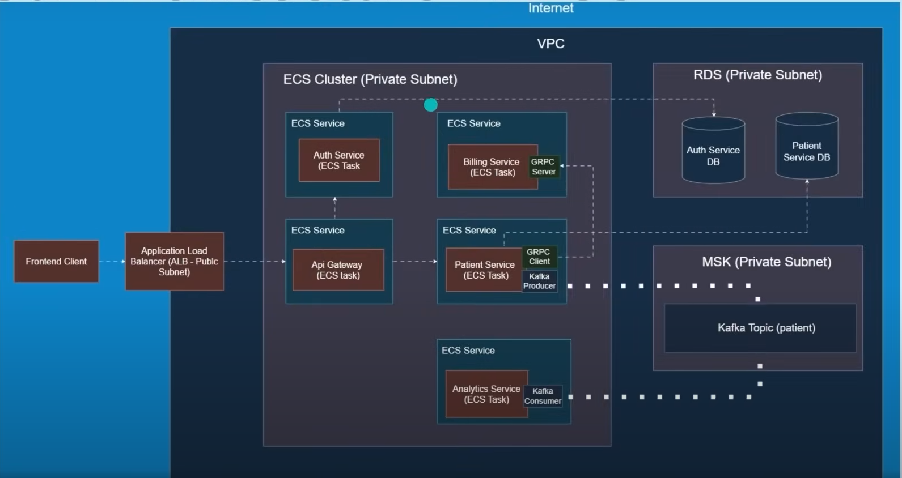
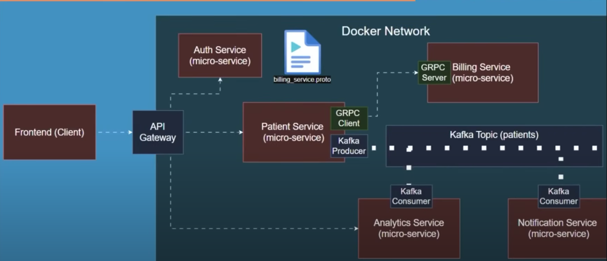

# Patient Management System — Microservices with Java Spring Boot & AWS

A production-ready **Patient Management System** implemented with **Java Spring Boot** using a **microservices architecture**, deployed securely on **AWS ECS Fargate** with **RDS**, **MSK (Kafka)**, and an **Application Load Balancer (ALB)**.  
It supports local development with Docker and production-grade deployment with security best practices.

---

## 1. High-Level Architecture

### AWS Production Deployment

**Key Components**
- **Frontend Client** → **Application Load Balancer (Public Subnet)** → **API Gateway (ECS Task)**
- **Auth Service** (ECS Task) → **Auth Service DB** (RDS)
- **Patient Service** (ECS Task) → **Patient Service DB** (RDS)
- **Billing Service** (ECS Task) → gRPC server, consumed by Patient Service gRPC client
- **MSK (Kafka)** → topic `patients`
  - Produced by **Patient Service**
  - Consumed by **Analytics Service** and **Notification Service**
- Private subnets for ECS, RDS, MSK; ELB in public subnets

---

### Local Development (Docker Network)

- All services run as Docker containers on a single bridge network
- Kafka topic `patients`
- gRPC between Patient Service (client) and Billing Service (server)
- API Gateway routes requests from frontend

---

## 2. Microservices Overview

- **API Gateway** — REST entrypoint, auth token verification, routing
- **Auth Service** — user authentication, JWT issuance, RDS persistence
- **Patient Service** — patient CRUD, Kafka producer, gRPC client to Billing
- **Billing Service** — gRPC server, billing calculations, invoice generation
- **Analytics Service** — Kafka consumer, processes patient events for reports
- **Notification Service** — Kafka consumer, sends alerts via email/SMS

---

## 3. Tech Stack

- **Backend**: Java 21, Spring Boot 3.x, Spring Cloud
- **Messaging**: Apache Kafka (MSK in prod, local Kafka in dev)
- **Databases**: Amazon RDS (PostgreSQL/MySQL)
- **Communication**: gRPC with Protobuf
- **Containers**: Docker, AWS ECS Fargate
- **Infrastructure**: AWS VPC, ALB, RDS, MSK, Security Groups
- **IaC**: AWS CDK
- **Security**: JWT

---

